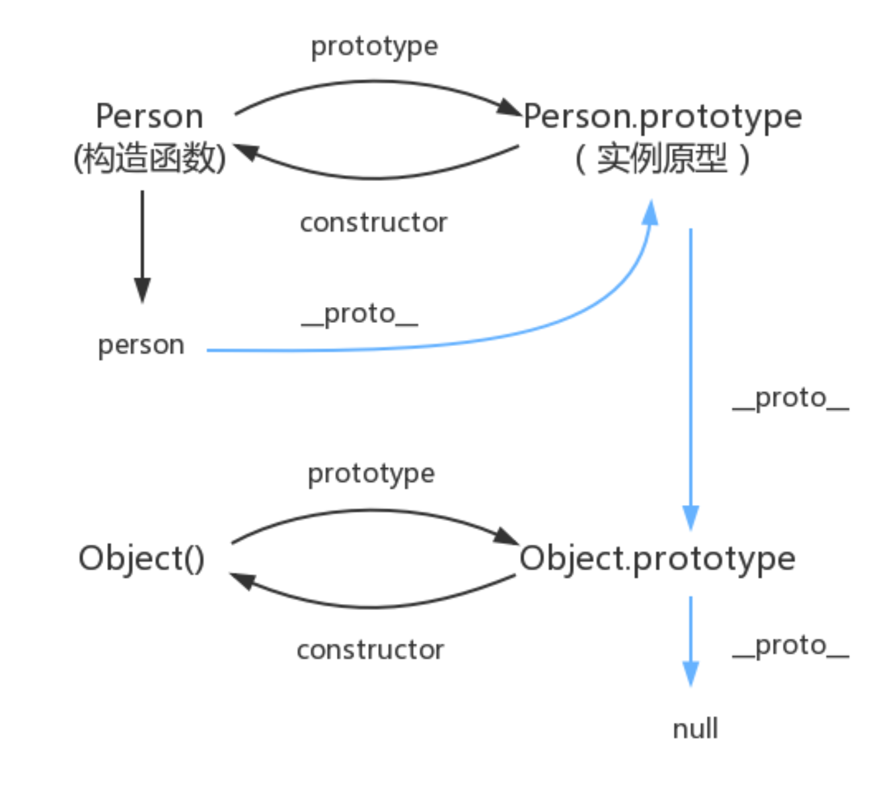

## prototype
大部分面向对象的编程语言，都是通过“类”（class）来实现对象的继承。JavaScript 语言的继承则是通过“原型对象”（prototype）。
JavaScript 继承机制的设计思想就是，原型对象的所有属性和方法，都能被实例对象共享。也就是说，如果属性和方法定义在原型上，那么所有实例对象就能共享，不仅节省了内存，还体现了实例对象之间的联系。
JavaScript 规定，每个函数都有一个prototype属性，指向一个对象。
```
    function f() {}
    typeof f.prototype // "object"
```

对于普通函数来说，该属性基本无用。但是，对于构造函数来说，生成实例的时候，该属性会自动成为实例对象的原型。
```
    function Animal(name) {
    this.name = name;
    }
    Animal.prototype.color = 'white';

    var cat1 = new Animal('大毛');
    var cat2 = new Animal('二毛');

    cat1.color // 'white'
    cat2.color // 'white'
```
上面代码中，构造函数Animal的prototype属性，就是实例对象cat1和cat2的原型对象。原型对象上添加一个color属性，结果，实例对象都共享了该属性。
当实例对象本身没有某个属性或方法的时候，它会到原型对象去寻找该属性或方法。

不用构造函数，以一个对象为原型创建一个新对象，调用**Object.create()**方法
```
    // 原型对象
    var A = {
    print: function () {
        console.log('hello');
    }
    };

    // 实例对象
    var B = Object.create(A);

    Object.getPrototypeOf(B) === A // true
    B.print() // hello
    B.print === A.print // true
```
Object.create方法生成的对象，继承了它的原型对象的构造函数。
```
    function A() {}
    var a = new A();
    var b = Object.create(a);

    b.constructor === A // true
    b instanceof A // true
```
上面代码中，b对象的原型是a对象，因此继承了a对象的构造函数A。
***

## `__proto__`
这是每一个JavaScript对象(除了 null )都具有的一个属性，叫`__proto__`，这个属性会指向该对象的原型。
```
    function Person() {

    }
    var person = new Person();
    console.log(person.__proto__ === Person.prototype); // true
```
绝大部分浏览器都支持这个非标准的方法访问原型，然而它并不存在于 Person.prototype 中，实际上，它是来自于 Object.prototype ，与其说是一个属性，不如说是一个 getter/setter，当使用 obj._proto_时，可以理解成返回了 **Object.getPrototypeOf(obj)**。

## constructor
每个原型都有一个 constructor 属性指向关联的构造函数。
```
    function Person() {

    }
    console.log(Person === Person.prototype.constructor); // true   
```
constructor属性是构造函数对应原型对象必须的属性，当原型对象改变指向的时候，要为它添加constructor属性。

## 原型链
JavaScript 规定，所有对象都有自己的原型对象（prototype）。一方面，任何一个对象，都可以充当其他对象的原型；另一方面，由于原型对象也是对象，所以它也有自己的原型。因此，就会形成一个“原型链”（prototype chain）：对象到原型，再到原型的原型……
原型链尽头为null，即Object.prototype.`__proto__`的值为 null。
Object.prototype.`__proto__`的值为 null 跟 Object.prototype 没有原型，其实表达了一个意思。所以查找属性的时候查到 Object.prototype 就可以停止查找了。
关系图：

<center>图中蓝色线就表示原型链</center>

