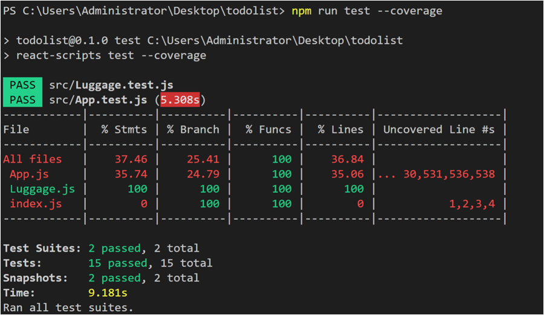

## Jest简介
Jest是 Facebook 的一套开源的 JavaScript 测试框架， 它自动集成了断言、覆盖率报告等开发者 所需要的所有测试工具，是一款几乎零配置的测试框架。并且它对同样是 Facebook 的开源前端框架 React 的测试十分友好。

## Jest特点
 - 易用性：基于Jasmine，提供断言库，支持多种测试风格
 - 适应性：Jest是模块化、可扩展和可配置的
 - 沙箱和快照：Jest内置了JSDOM，能够模拟浏览器环境，并且并行执行
 - 快照测试：Jest能够对React组件树进行序列化，生成对应的字符串快照，通过比较字符串提供高性能的UI检测
 - Mock系统：Jest实现了一个强大的Mock系统，支持自动和手动mock
 - 自动生成静态分析结果：内置Istanbul，测试代码覆盖率，并生成对应的报告

## 环境配置
用create-react-app创建的应用自带了Jest库，测试文件存于后缀为.test.js的文件中
运行以下代码即可进入测试：
```
npm run test
```
为了方便测试react组件，需要引入一个辅助工具Enzyme，安装对应npm包：
```
npm install --save-dev enzyme react-addons-test-utils
```

react16需要安装配置：
```
npm i -D enzyme-adapter-react-16
```
测试文件中添加以下代码：
```
import { configure } from 'enzyme';
import Adapter from 'enzyme-adapter-react-16';

configure({ adapter: new Adapter() });
```

## 单元测试代码组织
Jest框架下每个测试用例（test case）用一个it函数代表

一个简单的测试用例代码：
```
it(‘test case name', () => {
       //添加断言语句
});
```

组织多个it函数，可以用测试套件describe函数(**使用describe函数的目的主要是为了重用共同的环境设置**)
例如：
```
describe(‘App test’,() => {
       it(‘test case name', () => {
       //添加断言语句
       });
       //可以有更多的it函数调用
});
```

一个简单的测试用例的例子：
 sum.js文件：
 ```
	function sum(a, b) { 
	return a + b;
	 } 
	module.exports =sum;
```

sum.test.js文件:
```
const sum = require('./sum'); 
it('adds 1 + 2 to equal 3', () => {   
    expect(sum(1, 2)).toBe(3);
 });
 ```
### 常见断言
- expect(value)：要测试一个值进行断言的时候，要使用expect对值进行包裹
- toBe(value)：使用Object.is来进行比较，如果进行浮点数的比较，要使用toBeCloseTo
- not：用来取反
- toEqual(value)：用于对象的深比较
- toMatch(regexpOrString)：用来检查字符串是否匹配，可以是正则表达式或者字符串
- toContain(item)：用来判断item是否在一个数组中，也可以用于字符串的判断

## react组件测试
Enzyme能让我们方便测试React组件,提供了三种渲染React组件DOM树的方法：
- **shallow**：浅渲染，将组件渲染成虚拟DOM对象，只会渲染第一层，子组件将不会被渲染出来，使得效率非常高。不需要DOM环境， 并可以使用jQuery的方式访问组件的信息
- **render**：静态渲染，它将React组件渲染成静态的HTML字符串，然后使用Cheerio这个库解析这段字符串，并返回一个Cheerio的实例对象，可以用来分析组件的html结构
- **mount**：完全渲染，它将组件渲染加载成一个真实的DOM节点，用来测试DOM API的交互和组件的生命周期。用到了jsdom来模拟浏览器环境

Enzyme提供了.find()函数查找DOM节点，.simulate()函数模拟DOM的事件

例如这里用.find()函数找到button元素，模拟按钮点击
```
    it('after click ', () => {
      let wrapper=mount(<App />);
      wrapper.find('button').simulate('click');
      expect(wrapper.state('cost')).toBe("总费用￥450");
    });
```
模拟input框输入：
```
    it('when last input change,onChang() should be called', () => {
      wrapper.find('input').last().simulate('change', {
          target: {
            name: 'height',
            value: '5'
          }});
          expect(wrapper.state('list')[1].height).toBe(5);
    });
```

### 快照测试
快照测试html元素,render渲染组件，只关注组件html结构:
```
it('basic use', () => {
  const wrapper = render(<App />);
  expect(toJson(wrapper)).toMatchSnapshot();
})
```
会生成对应快照文件_snapshots_，文件中存有对应组件渲染出的html结构

### 生成测试覆盖率
- 行覆盖率(line coverage)：是否测试用例的每一行都执行了
- 函数覆盖率(function coverage)：师傅测试用例的每一个函数都调用了
- 分支覆盖率(branch coverage)：是否测试用例的每个if代码块都执行了
- 语句覆盖率(statement coverage)：是否测试用例的每个语句都执行了
```
npm run test --coverage
```


## 项目链接
[github](https://github.com/yfy1998/Baggage-check-in)

## 参考链接
[使用Jest进行React单元测试](https://www.codercto.com/a/23030.html)
[React Jest UI测试](https://blog.csdn.net/m0_37068028/article/details/83625354)
[基于 Jest + Enzyme 的 React 单元测试](https://blog.csdn.net/qq673318522/article/details/70857678)


